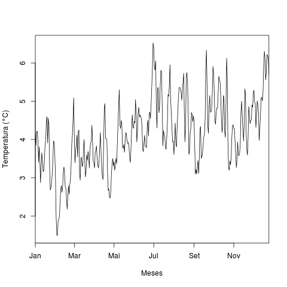
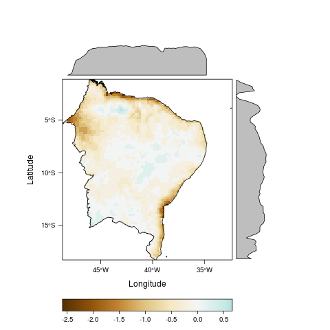

**DESCRIPTION**

Simple scripts in R to calculate and plot changes in temperature and precipitation on the year 2075, in relation to the present mean state, over the brazilian northeast.

The atmospheric data are from outputs of CORDEX experiments, which are downscaled from CMIP5 globar warming experiments outputs. The data was downloaded from https://esgf-index1.ceda.ac.uk/search/esgf-ceda/, in NetCDF format.

To crop the atmospheric data, a shapefile delimiting the northeast region was used, downloaded from https://www.ipea.gov.br/ipeageo/malhas.html.

From the results, a brief report was written, defining possible impacts and mitigation strategies.

**OUTPUT EXAMPLES**

The image on the left is a time series of the daily temperature anomaly over the entire region in the year 2075.

The image on the right represents the average spatial distribution of precipitation change.  

  
   	
</p

